# MOBILE-ARCHITECTURE.md

> **Windy Pro Mobile** — Comprehensive architecture map
> Generated 2026-03-12 · Expo SDK 53 + React Native

---

## 1. Directory Tree

```
src/
├── app/                          # Expo Router file-based navigation
│   ├── _layout.tsx               # Root layout: providers, splash, deep links, network banner
│   ├── (tabs)/                   # Bottom tab navigator
│   │   ├── _layout.tsx           # Tab bar config (6 tabs, dark theme, lime accent)
│   │   ├── index.tsx             # 🎤 Record — main recording screen
│   │   ├── camera.tsx            # 📷 Camera — OCR / video capture launcher
│   │   ├── history.tsx           # 📋 History — session list with search & filters
│   │   ├── clone-data.tsx        # 🧬 Clone — voice clone progress dashboard
│   │   ├── chat.tsx              # 💬 Chat — Matrix-based messaging list
│   │   └── settings.tsx          # ⚙️ Settings — all user preferences
│   ├── appstore/index.tsx        # App Store / Play Store promo page
│   ├── auth/
│   │   ├── login.tsx             # Cloud API login form
│   │   └── register.tsx          # Cloud API registration form
│   ├── chat/
│   │   ├── index.tsx             # Chat room list (DMs)
│   │   ├── [roomId].tsx          # Individual chat conversation
│   │   └── profile.tsx           # User/contact profile view
│   ├── clone-data/index.tsx      # Clone data expanded view
│   ├── clone/index.tsx           # Voice clone training overview
│   ├── legal/
│   │   ├── privacy.tsx           # Privacy Policy
│   │   └── terms.tsx             # Terms of Service
│   ├── ocr/index.tsx             # OCR camera capture + translation
│   ├── onboarding/index.tsx      # First-launch onboarding flow
│   ├── quick-translate.tsx       # Quick translate (deep-link/share sheet entry)
│   ├── session/[id].tsx          # Single recording session detail/playback
│   ├── subscription/index.tsx    # Paywall / subscription management
│   ├── translate/index.tsx       # Full speech-to-speech translation
│   └── video/index.tsx           # Video recording mode
│
├── assets/
│   ├── adaptive-icon.png         # Android adaptive icon
│   ├── icon.png                  # App icon 1024×1024
│   └── splash.png                # Splash screen image
│
├── components/
│   ├── EmptyState.tsx            # Reusable empty-state placeholder
│   ├── EnginePickerSheet.tsx     # Bottom sheet: select transcription engine
│   ├── ErrorBoundary.tsx         # React error boundary (app-level)
│   ├── LanguagePickerSheet.tsx   # Bottom sheet: select source/target language
│   ├── LoadingSpinner.tsx        # Themed loading indicator
│   ├── NetworkBanner.tsx         # Offline/online status bar
│   ├── ScreenErrorBoundary.tsx   # Per-screen error boundary
│   ├── SpeechWaveform.tsx        # Animated audio waveform visualizer
│   ├── SyncStatusBanner.tsx      # Cloud sync progress bar
│   └── TranscriptionViewer.tsx   # Real-time transcript segment display
│
├── config/
│   └── api.ts                    # Centralized API base URL + all endpoint paths
│
├── hooks/
│   ├── useAccessibility.ts       # VoiceOver/TalkBack utilities
│   ├── useFeatureGate.ts         # License-tier feature gating hook
│   ├── useHaptic.ts              # Simplified haptic trigger hook
│   └── useReducedMotion.ts       # Respects OS reduce-motion setting
│
├── services/                     # Core business logic (28 service modules)
│   ├── analytics.ts              # Local analytics tracking (screen views, translations)
│   ├── audio-capture.ts          # Audio recording via expo-av (metering, quality scoring)
│   ├── chatClient.ts             # Matrix SDK wrapper (auth, rooms, messages, presence)
│   ├── chatTranslate.ts          # On-device chat message translation middleware
│   ├── clone-bundle.ts           # Clone training bundle manager (audio + video + transcript)
│   ├── clone-tracker.ts          # Voice clone progress tracker (10-hour goal, milestones)
│   ├── cloud-sync.ts             # Recording sync orchestration (upload, download, conflict)
│   ├── cloudApi.ts               # R2 cloud storage typed client (auth, upload, list, delete)
│   ├── engine-download.ts        # Whisper GGML model downloader from HuggingFace CDN
│   ├── feedback.ts               # Haptic feedback service (record start/stop, success, error)
│   ├── keyboard.ts               # iOS keyboard extension bridge (App Group, Live Activity)
│   ├── license.ts                # License validation, feature matrix, recording limits
│   ├── network-monitor.ts        # Periodic connectivity check + offline translation queue
│   ├── ocr.ts                    # OCR text extraction (Google Vision API + fallback)
│   ├── offline-packs.ts          # Offline language pack manager
│   ├── overlay.ts                # Android floating overlay service
│   ├── push-notifications.ts     # Push notification service (FCM, channels, local notifs)
│   ├── quality-scorer.ts         # Audio quality scoring (SNR, clipping, speech ratio)
│   ├── rating-prompt.ts          # In-app rating prompt logic
│   ├── speech-translation.ts     # Speech-to-speech translation pipeline (record → upload → TTS)
│   ├── storage-cloud.ts          # Legacy cloud storage client (v1 API, deprecated → cloudApi)
│   ├── storage-local.ts          # SQLite local storage (sessions CRUD, sync queue, settings)
│   ├── subscription.ts           # RevenueCat subscription management (offerings, purchases)
│   ├── sync-engine.ts            # Background sync engine (Wi-Fi/battery aware, JWT auth)
│   ├── sync-manager.ts           # Wi-Fi auto-sync manager (priority queue, chunked upload)
│   ├── transcription.ts          # Audio transcription (cloud HTTP/WS + on-device whisper.rn)
│   ├── translation.ts            # Text/speech translation, language detection, TTS, export
│   ├── video-capture.ts          # Video recording via expo-camera
│   ├── whisper-manager.ts        # On-device whisper.rn lifecycle manager
│   └── windy-tune.ts             # Intelligent engine auto-configuration + model download manager
│   └── __tests__/                # 14 unit test files for services
│
├── stores/                       # Zustand global state stores
│   ├── useRecordingStore.ts      # Recording state machine (idle → recording → processing)
│   ├── useSettingsStore.ts       # All user preferences (persisted via AsyncStorage)
│   └── useTranscriptStore.ts     # Real-time transcript segment buffer
│
├── theme/
│   ├── colors.ts                 # Color palette (dark theme, lime accent)
│   ├── index.ts                  # Theme barrel export
│   ├── spacing.ts                # Spacing scale
│   └── typography.ts             # Typography scale (Inter font)
│
├── types/
│   ├── api.ts                    # API response types
│   ├── engine.ts                 # Engine config, device profile, WindyTune result types
│   ├── index.ts                  # Barrel re-export of all types
│   ├── react-native-purchases.d.ts  # RevenueCat type augmentation
│   ├── recording.ts              # Recording state, media capture types
│   └── session.ts                # Session, segment, filter, quality types
│
└── utils/
    ├── api-error.ts              # API error parsing, user-friendly messages, retry helpers
    └── fetch-timeout.ts          # Fetch wrapper with AbortController timeout
```

---

## 2. Services Map

### 2.1 `transcription.ts`

| Field | Detail |
|-------|--------|
| **Purpose** | Audio → text transcription (cloud streaming + on-device Whisper) |
| **API Calls** | `POST /api/v1/transcribe` (HTTP), `ws://…/ws/transcribe` (WebSocket) |
| **Depends On** | `config/api`, `whisper-manager`, `audio-capture` |
| **Status** | **Partial** — Cloud transcription complete; on-device `localTranscribe` stub awaiting `whisper.rn` install |

### 2.2 `translation.ts`

| Field | Detail |
|-------|--------|
| **Purpose** | Text translation, speech-to-speech, language detection, TTS, conversation export |
| **API Calls** | `POST /api/v1/translate/text`, `POST /api/v1/translate/speech`, `GET /api/v1/translate/languages` |
| **Depends On** | `config/api`, `expo-av` (TTS playback) |
| **Status** | **Complete** |

### 2.3 `speech-translation.ts`

| Field | Detail |
|-------|--------|
| **Purpose** | Hardened speech-to-speech pipeline: record → upload → translate → TTS playback |
| **API Calls** | `POST /api/v1/translate/speech` |
| **Depends On** | `translation`, `audio-capture`, `network-monitor`, `feedback` |
| **Status** | **Complete** — retry, timeout, language validation baked in |

### 2.4 `cloud-sync.ts`

| Field | Detail |
|-------|--------|
| **Purpose** | Synchronize recordings between local SQLite and cloud |
| **API Calls** | Uses `cloudApi` (upload/list/download) |
| **Depends On** | `cloudApi`, `storage-local`, `network-monitor` |
| **Status** | **Complete** — offline queue, conflict resolution (newer wins), progress callbacks |

### 2.5 `subscription.ts`

| Field | Detail |
|-------|--------|
| **Purpose** | RevenueCat in-app subscription management |
| **API Calls** | RevenueCat SDK (native) |
| **Depends On** | `react-native-purchases`, `license` |
| **Status** | **Complete** — offerings, purchase, restore, entitlement → tier mapping |

### 2.6 `ocr.ts`

| Field | Detail |
|-------|--------|
| **Purpose** | OCR text extraction from images with optional translation |
| **API Calls** | `POST /api/v1/ocr/translate` (Google Vision API) |
| **Depends On** | `translation`, `config/api` |
| **Status** | **Complete** — cloud OCR with on-device fallback stub |

### 2.7 `license.ts`

| Field | Detail |
|-------|--------|
| **Purpose** | License validation, feature gating matrix, recording limits |
| **API Calls** | `POST /api/v1/license/activate` |
| **Depends On** | `config/api`, `expo-secure-store` |
| **Status** | **Complete** — 4 tiers (free/pro/translate/translate_pro), purchase URL via Stripe |

### 2.8 `chatClient.ts`

| Field | Detail |
|-------|--------|
| **Purpose** | Real-time chat via Matrix protocol (rooms, messages, presence, typing, contacts) |
| **API Calls** | Matrix homeserver API (via `matrix-js-sdk`) |
| **Depends On** | `matrix-js-sdk`, `expo-secure-store` |
| **Status** | **Complete** — auth, DM rooms, message send/receive, offline queue, E2E encryption init (Olm may not be bundled) |

### 2.9 `audio-capture.ts`

| Field | Detail |
|-------|--------|
| **Purpose** | Audio recording with real-time metering and quality scoring |
| **API Calls** | None (local only) |
| **Depends On** | `expo-av` |
| **Status** | **Complete** |

### 2.10 `storage-local.ts`

| Field | Detail |
|-------|--------|
| **Purpose** | SQLite local database for sessions, settings, engine state, sync queue |
| **API Calls** | None (local only) |
| **Depends On** | `expo-sqlite`, `expo-file-system` |
| **Status** | **Complete** — full CRUD, 22-column schema, indexed by `created_at`, `synced`, `source`, `quality_score` |

### 2.11 `storage-cloud.ts` *(deprecated)*

| Field | Detail |
|-------|--------|
| **Purpose** | Legacy v1 cloud storage client — being replaced by `cloudApi` |
| **API Calls** | `POST /api/v1/auth/login`, `POST /api/v1/recordings/upload`, `GET /api/v1/recordings/list`, `GET /api/v1/recordings/:id`, `DELETE /api/v1/recordings/:id` |
| **Depends On** | `config/api`, `expo-secure-store`, `expo-file-system`, `utils/api-error` |
| **Status** | **Deprecated** — kept for backward compat; use `cloudApi` for new code |

### 2.12 `cloudApi.ts`

| Field | Detail |
|-------|--------|
| **Purpose** | Typed R2 cloud storage client (auth, upload, list, download, delete, health) |
| **API Calls** | `POST /api/auth/register`, `POST /api/auth/login`, `POST /api/storage/files/upload`, `GET /api/storage/files`, `GET /api/storage/files/:id`, `DELETE /api/storage/files/:id`, `GET /api/storage/health` |
| **Depends On** | `config/api`, `expo-secure-store`, `expo-file-system` |
| **Status** | **Complete** — JWT auth, 30s timeout, retry queue, storage tier limits |

### 2.13 `network-monitor.ts`

| Field | Detail |
|-------|--------|
| **Purpose** | Periodic health endpoint ping + offline translation queue |
| **API Calls** | `HEAD /health` (every 30s) |
| **Depends On** | `config/api`, `expo-file-system` |
| **Status** | **Complete** |

### 2.14 `windy-tune.ts`

| Field | Detail |
|-------|--------|
| **Purpose** | Intelligent engine recommendation + model download manager |
| **API Calls** | CDN download `https://windyword.ai/models/{engine}.bin` |
| **Depends On** | `expo-device`, `expo-file-system`, `async-storage` |
| **Status** | **Complete** — device profiling, 8-engine registry, resumable downloads, progress tracking |

### 2.15 `push-notifications.ts`

| Field | Detail |
|-------|--------|
| **Purpose** | Push notification setup, token registration, local notifications |
| **API Calls** | `POST /api/register-push-token` |
| **Depends On** | `expo-notifications`, `expo-device`, `expo-constants` |
| **Status** | **Complete** — FCM, Android channels, translation/subscription/update notifs |

### 2.16 `sync-manager.ts`

| Field | Detail |
|-------|--------|
| **Purpose** | Wi-Fi-aware auto-sync with upload queue, priority, chunking, background task |
| **API Calls** | `POST /api/v1/recordings/upload`, `/api/v1/recordings/upload/chunk`, `/api/v1/recordings/upload/batch`, `GET /api/v1/recordings/check` |
| **Depends On** | `cloudApi`, `netinfo`, `expo-file-system`, `expo-background-fetch`, `expo-task-manager`, `config/api`, `utils/api-error` |
| **Status** | **Complete** — priority queue (transcript > audio > video), Wi-Fi/cellular awareness, chunked resume, background sync every 15 min |

### 2.17 `sync-engine.ts`

| Field | Detail |
|-------|--------|
| **Purpose** | Session-level sync orchestrator (get pending → auth → upload → mark synced) |
| **API Calls** | Uses `storage-cloud` (legacy v1 endpoints) |
| **Depends On** | `storage-local`, `storage-cloud`, `netinfo`, `expo-battery`, `expo-background-fetch`, `expo-task-manager` |
| **Status** | **Complete** — background sync every 15 min, exponential backoff, battery/Wi-Fi checks |

### 2.18 `analytics.ts`

| Field | Detail |
|-------|--------|
| **Purpose** | Lightweight local analytics (screen views, translations, language pairs, recording duration) |
| **API Calls** | None (local AsyncStorage only; backend sync placeholder) |
| **Depends On** | `async-storage` |
| **Status** | **Partial** — local tracking complete; server-side sync not implemented |

### 2.19 `clone-tracker.ts`

| Field | Detail |
|-------|--------|
| **Purpose** | Silent accumulation toward 10-hour voice clone threshold |
| **API Calls** | None |
| **Depends On** | `quality-scorer`, `feedback`, `storage-local`, `expo-notifications`, `async-storage` |
| **Status** | **Complete** — quality-weighted hours, 4 milestones (25/50/75/100%), haptic celebrations |

### 2.20 `clone-bundle.ts`

| Field | Detail |
|-------|--------|
| **Purpose** | Standardized audio+video+transcript bundles for clone training upload |
| **API Calls** | `POST /api/v1/recordings/upload` |
| **Depends On** | `network-monitor`, `expo-file-system`, `expo-battery`, `async-storage`, `config/api` |
| **Status** | **Complete** |

### 2.21 `chatTranslate.ts`

| Field | Detail |
|-------|--------|
| **Purpose** | On-device translation middleware for chat messages (LRU cache, batch support) |
| **API Calls** | None (uses `translationService` internally) |
| **Depends On** | `translation` |
| **Status** | **Complete** — LRU cache (100 entries), batch translation (5 per batch) |

### 2.22 `feedback.ts`

| Field | Detail |
|-------|--------|
| **Purpose** | Haptic feedback abstraction (respects user settings) |
| **API Calls** | None |
| **Depends On** | `expo-haptics`, `useSettingsStore` |
| **Status** | **Complete** |

### 2.23 `keyboard.ts`

| Field | Detail |
|-------|--------|
| **Purpose** | iOS Keyboard Extension bridge (App Group, settings sync, Live Activity) |
| **API Calls** | None (native bridge via `NativeModules`) |
| **Depends On** | `react-native` NativeModules |
| **Status** | **Stubbed** — JS bridge ready; Swift native keyboard extension not yet built |

### 2.24 `engine-download.ts`

| Field | Detail |
|-------|--------|
| **Purpose** | Downloads whisper.cpp GGML models from HuggingFace CDN |
| **API Calls** | `https://huggingface.co/ggerganov/whisper.cpp/resolve/main/{model}.bin` |
| **Depends On** | `expo-file-system` |
| **Status** | **Complete** — resumable downloads, cancel, delete, storage accounting |

### 2.25–2.28 Additional Services

| Service | Purpose | Status |
|---------|---------|--------|
| `offline-packs.ts` | Offline language pack download manager | **Complete** |
| `overlay.ts` | Android floating overlay service | **Partial** — platform-specific, Android only |
| `quality-scorer.ts` | Audio quality scoring (SNR, clipping, speech ratio) | **Complete** |
| `rating-prompt.ts` | In-app rating prompt logic | **Complete** |
| `video-capture.ts` | Video recording via expo-camera | **Complete** |
| `whisper-manager.ts` | On-device Whisper model lifecycle manager | **Stubbed** — awaiting `whisper.rn` integration |

---

## 3. Screens & Navigation

### 3.1 Tab Bar (6 tabs)

| Tab | Route | Label | Components | Services Used |
|-----|-------|-------|------------|---------------|
| Record | `/(tabs)/index` | 🎤 Rec | `SpeechWaveform`, `EnginePickerSheet`, `LanguagePickerSheet`, `TranscriptionViewer` | `audio-capture`, `transcription`, `feedback`, `quality-scorer`, `clone-tracker` |
| Camera | `/(tabs)/camera` | 📷 Cam | Camera viewfinder, OCR trigger | `ocr`, `video-capture`, `feedback` |
| History | `/(tabs)/history` | 📋 Hist | Session list, search bar, filters | `storage-local`, `cloud-sync` |
| Clone | `/(tabs)/clone-data` | 🧬 Clone | Progress ring, milestone list, tips | `clone-tracker`, `clone-bundle` |
| Chat | `/(tabs)/chat` | 💬 Chat | Room list, unread badges | `chatClient`, `chatTranslate` |
| Settings | `/(tabs)/settings` | ⚙️ More | Preferences, engine picker, sync toggle, license display | `useSettingsStore`, `subscription`, `license`, `sync-engine`, `windy-tune` |

### 3.2 Modal / Stack Routes

| Route | Presentation | Purpose | Services |
|-------|-------------|---------|----------|
| `/onboarding` | fullScreenModal, fade | First-launch flow | `useSettingsStore` |
| `/session/[id]` | modal, slide_from_bottom | Session detail/playback | `storage-local`, `translation` |
| `/translate` | modal, slide_from_bottom | Full speech-to-speech translation | `speech-translation`, `translation`, `audio-capture` |
| `/clone` | modal, slide_from_bottom | Clone training overview | `clone-tracker`, `clone-bundle` |
| `/ocr` | modal, slide_from_bottom | OCR camera + translate | `ocr`, `translation` |
| `/subscription` | modal, slide_from_bottom | Paywall / subscription | `subscription`, `license` |
| `/video` | modal, slide_from_bottom | Video recording mode | `video-capture`, `audio-capture` |
| `/appstore` | modal, slide_from_bottom | App Store promo page | — |
| `/quick-translate` | modal, slide_from_bottom | Quick translate entry point | `translation` |
| `/auth/login` | stack | Cloud API login | `cloudApi` |
| `/auth/register` | stack | Cloud API registration | `cloudApi` |
| `/chat/[roomId]` | stack | Chat conversation | `chatClient`, `chatTranslate` |
| `/chat/profile` | stack | Contact profile view | `chatClient` |
| `/clone-data` | stack | Expanded clone data | `clone-tracker` |
| `/legal/privacy` | stack, header shown | Privacy Policy | — |
| `/legal/terms` | stack, header shown | Terms of Service | — |

### 3.3 Deep Links (`windypro://` scheme)

| URL Pattern | Route |
|-------------|-------|
| `windypro://license?key=XXX` | Activates license → alert |
| `windypro://session/SESSION_ID` | `/session/[id]` |
| `windypro://translate` | `/translate` |
| `windypro://translate?text=X&from=Y&to=Z` | `/quick-translate?…` |
| `windypro://clone` | `/clone` |
| `windypro://subscribe` | `/subscription` |
| `windypro://settings` | `/(tabs)/settings` |

---

## 4. Third-Party Dependencies

| Package | Version | Feature |
|---------|---------|---------|
| `expo` | ~53.0.0-preview.7 | Core framework |
| `react-native` | 0.76.7 | UI runtime |
| `react` | 18.3.1 | Component model |
| `expo-router` | ~4.1.0-preview.0 | File-based routing |
| `expo-splash-screen` | ~0.30.1 | Splash screen control |
| `expo-status-bar` | ~2.2.3 | Status bar theming |
| `expo-av` | ~15.0.2 | Audio recording & playback |
| `expo-camera` | ~16.1.6 | Camera access (OCR, video) |
| `expo-file-system` | ~18.1.1 | File I/O, download, upload |
| `expo-sqlite` | ~15.1.3 | Local SQLite database |
| `expo-secure-store` | ~14.2.3 | Encrypted token storage |
| `expo-constants` | ~17.1.5 | App config, device info |
| `expo-device` | ~7.1.4 | Device profiling (RAM, model) |
| `expo-haptics` | ~14.1.4 | iOS/Android haptic feedback |
| `expo-notifications` | ~0.30.3 | Push notifications (FCM) |
| `expo-linking` | ~7.1.5 | Deep links & URL scheme |
| `expo-navigation-bar` | ~4.1.4 | Android nav bar theming |
| `expo-background-fetch` | ~13.1.4 | Background sync tasks |
| `expo-task-manager` | ~12.1.4 | Background task manager |
| `expo-battery` | ~9.0.4 | Battery state for sync conditions |
| `@react-native-async-storage/async-storage` | 1.23.1 | Persistent key-value storage |
| `@react-native-community/netinfo` | 11.4.1 | Network state detection |
| `react-native-safe-area-context` | 5.3.0 | Safe area insets |
| `react-native-screens` | ~4.10.0 | Native screen containers |
| `react-native-reanimated` | ~3.16.7 | Animations (waveform, etc.) |
| `react-native-gesture-handler` | ~2.24.0 | Gesture support |
| `react-native-purchases` | 8.2.7 | RevenueCat IAP/subscriptions |
| `react-native-share` | 12.0.2 | Native share sheet |
| `matrix-js-sdk` | ^35.1.0 | Matrix chat protocol |
| `zustand` | ^5.0.3 | Global state management |
| `@expo-google-fonts/inter` | ^0.2.3 | Inter font family |
| `react-native-svg` | 15.11.2 | SVG rendering (icons, charts) |
| `@react-native-community/slider` | 4.5.6 | Seek slider for audio playback |
| `expo-clipboard` | ~7.1.4 | Copy to clipboard |
| `expo-web-browser` | ~14.1.6 | Open URLs in-app |

---

## 5. Service Dependency Graph

```mermaid
graph TD
    subgraph "Cloud & Storage"
        CAPI[cloudApi]
        SC_LEGACY[storage-cloud ⚠️ deprecated]
        SL[storage-local / SQLite]
        SM[sync-manager]
        SE[sync-engine]
        CS[cloud-sync]
    end

    subgraph "Audio & Transcription"
        AC[audio-capture]
        TX[transcription]
        WM[whisper-manager]
        QS[quality-scorer]
        ED[engine-download]
        WT[windy-tune]
    end

    subgraph "Translation"
        TL[translation]
        STL[speech-translation]
        OCR[ocr]
        CT[chatTranslate]
        OP[offline-packs]
    end

    subgraph "Chat"
        CC[chatClient]
        CT
    end

    subgraph "Clone"
        CLT[clone-tracker]
        CLB[clone-bundle]
    end

    subgraph "Business Logic"
        LIC[license]
        SUB[subscription]
        FB[feedback]
        AN[analytics]
        PN[push-notifications]
        NM[network-monitor]
        KB[keyboard]
        RP[rating-prompt]
    end

    %% Cloud & Storage
    SM --> CAPI
    SM --> NM
    SE --> SL
    SE --> SC_LEGACY
    CS --> CAPI
    CS --> SL
    CS --> NM

    %% Audio & Transcription
    TX --> WM
    TX --> AC
    WT --> ED
    CLT --> QS

    %% Translation
    STL --> TL
    STL --> AC
    STL --> NM
    STL --> FB
    OCR --> TL
    CT --> TL

    %% Clone
    CLT --> FB
    CLB --> NM

    %% Business Logic
    SUB --> LIC
    FB -.-> |reads| SS[useSettingsStore]
```



---

## 6. Feature Completeness Matrix

| Feature | Status | Notes |
|---------|--------|-------|
| **Transcription (cloud)** | ✅ Complete | HTTP POST + WebSocket streaming to `/api/v1/transcribe` |
| **Transcription (on-device)** | 🟡 Partial | `localTranscribe` stub present; awaiting `whisper.rn` native module |
| **Text Translation** | ✅ Complete | 30+ languages via `/api/v1/translate/text` |
| **Speech Translation** | ✅ Complete | Full pipeline: record → upload → translate → TTS playback with retries |
| **Chat (Matrix)** | ✅ Complete | Auth, DM rooms, messages, presence, typing, contacts, offline queue |
| **Chat Translation** | ✅ Complete | On-device LRU-cached translation middleware for incoming messages |
| **OCR** | ✅ Complete | Google Vision API cloud OCR; local fallback stub |
| **Camera / Video** | ✅ Complete | expo-camera integration for OCR and video recording |
| **Audio Recording** | ✅ Complete | WAV recording with metering, quality scoring, configurable sample rate |
| **Cloud Sync** | ✅ Complete | Dual-path sync (legacy v1 + new R2 API), Wi-Fi/cellular awareness, background sync |
| **Subscriptions (IAP)** | ✅ Complete | RevenueCat integration with offerings, purchase, restore, entitlement mapping |
| **Push Notifications** | ✅ Complete | Expo Notifications with FCM, 3 Android channels, token registration |
| **Voice Clone Tracking** | ✅ Complete | 10-hour goal, quality-weighted progress, 4 milestones with haptic celebrations |
| **Clone Bundle Upload** | ✅ Complete | Audio + video + transcript bundled upload to cloud |
| **Engine Auto-Config** | ✅ Complete | WindyTune device profiling, 8-engine registry, resumable model downloads |
| **License / Feature Gating** | ✅ Complete | 4 tiers with feature matrix, recording limits, Stripe checkout integration |
| **iOS Keyboard Extension** | 🔴 Stubbed | JS bridge ready; Swift `KeyboardViewController` not yet implemented |
| **On-Device Whisper** | 🔴 Stubbed | `whisper-manager` lifecycle ready; `whisper.rn` native module not installed |
| **Analytics (server sync)** | 🟡 Partial | Local tracking works; server-side data push not implemented |
| **Android Floating Overlay** | 🟡 Partial | Service exists; platform-specific, Android-only |
| **E2E Encryption (Chat)** | 🟡 Partial | Initialization code present; Olm crypto library may not be bundled with `matrix-js-sdk` |

---

## 7. Known Gaps & Technical Debt

### 🔴 Critical Gaps

1. **On-device Whisper not functional** — `whisper.rn` native module is not installed. `localTranscribe()` in `transcription.ts` and `whisper-manager.ts` are stubs. All transcription currently requires network.
2. **iOS Keyboard Extension** — `keyboard.ts` JS bridge is complete but the native Swift extension (`ios/WindyKeyboard/`) has not been built.

### 🟡 Moderate Debt

3. **Dual sync systems** — Both `sync-engine.ts` (legacy v1 API) and `sync-manager.ts` (new R2 API via `cloudApi`) exist side-by-side. `storage-cloud.ts` is explicitly deprecated in favor of `cloudApi.ts`. The migration should be completed and the legacy code removed.
4. **E2E encryption** — `chatClient.ts` initializes Matrix E2E encryption but notes that `matrix-js-sdk` may not bundle the Olm library. Verify Olm is available or add it as a dependency.
5. **Analytics server sync** — `analytics.ts` stores data locally in AsyncStorage with a note about "future backend sync," but no upload endpoint is implemented.
6. **`find_by_name` tooling** — Previous build attempts encountered "bad CPU type in executable" for `fd`, indicating potential architecture mismatch in dev tooling.

### 🟢 Minor Items

7. **Test coverage** — 14 test files exist under `src/services/__tests__/` but coverage for screens, components, hooks, and stores is missing.
8. **Duplicate background task registration** — Both `sync-engine.ts` and `sync-manager.ts` register separate background tasks (`WINDY_BACKGROUND_SYNC` and `windy-background-sync`). These should be consolidated.
9. **`storage-cloud.ts` backward compat shims** — `uploadFile()` and `uploadMetadata()` are no-ops kept for compat. Should be removed after migration.
10. **Network monitor queue** — `network-monitor.ts` maintains an in-memory translation queue that is lost on app restart. Consider persisting to AsyncStorage.
11. **`clone-bundle.ts` typo** — Log messages reference `[cloneuundle]` instead of `[clonebundle]`.

---

*Single source of truth for the Windy Pro mobile codebase. Update this document when architecture changes.*
