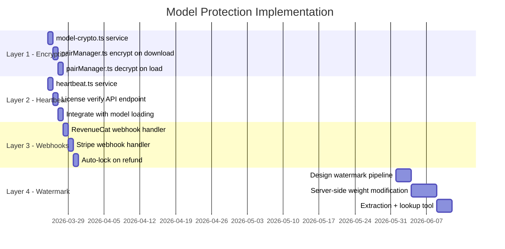

# 🔐 Model Protection Spec — Windy Traveler Engine DRM

**Version:** 1.0  
**Date:** 2026-03-18  
**Status:** Draft — Awaiting Implementation  
**Applies to:** All Windy Traveler translation model bundles (Traveler, Polyglot, Marco Polo)

---

## Executive Summary

Four-layer protection stack that makes model theft impractical without punishing legitimate customers. Each layer is independent — deploy them incrementally based on priority.

```
Layer 1: Encrypted Models (Device-Bound Keys)     ← Stops cold copying
Layer 2: License Heartbeat (Tiered Grace Periods)  ← Catches revoked licenses
Layer 3: Refund Webhooks (Auto-Lock on Refund)     ← Closes the refund loophole
Layer 4: Model Watermarking (Forensic Tracing)     ← Traces leaks to source
```

**Design principle:** No protection layer should degrade the offline experience. Travelers — the core market — are on planes, in foreign countries, and in areas with zero connectivity. DRM that breaks offline use breaks the product.

---

## Layer 1: Encrypted Model Files (Device-Bound Keys)

**Priority:** 🔴 Critical — Implement first  
**Effort:** Medium (2-3 days)  
**Stops:** File copying, device cloning, filesystem extraction

### How It Works

Models are stored encrypted on disk using AES-256-GCM. The decryption key is derived from three inputs that are unique to each device + license combination:

```
DecryptionKey = HKDF-SHA256(
    ikm:  licenseToken,           ← From SecureStore (unique per user)
    salt: deviceFingerprint,       ← From expo-device (unique per device)
    info: APP_SECRET_PEPPER        ← Hardcoded App secret (same for all installs)
)
```

### Encryption Flow (Download)

```
CDN ──[raw .bin]──→ App receives model
                     │
                     ├── 1. Generate DecryptionKey from (license + device + secret)
                     ├── 2. Generate random 96-bit IV per file
                     ├── 3. Encrypt: AES-256-GCM(key, iv, rawModel) → ciphertext + authTag
                     ├── 4. Write to disk: [IV (12 bytes)][AuthTag (16 bytes)][Ciphertext]
                     └── 5. Store hash of DecryptionKey in SecureStore (for integrity check)
```

### Decryption Flow (Model Load)

```
App needs model ──→ Read encrypted .bin from disk
                     │
                     ├── 1. Regenerate DecryptionKey from (license + device + secret)
                     ├── 2. Read IV + AuthTag from file header
                     ├── 3. Decrypt in memory: AES-256-GCM.decrypt(key, iv, authTag, ciphertext)
                     ├── 4. If AuthTag fails → license changed or file tampered → REJECT
                     └── 5. Pass decrypted model bytes to inference engine (never written to disk)
```

### What This Stops

| Attack | Stopped? | Why |
|--------|:---:|-----|
| Copy .bin files to another device | ✅ | Different deviceFingerprint → wrong key → garbage |
| Copy .bin files after license revoke | ✅ | Different licenseToken → wrong key → garbage |
| Jailbreak + filesystem extraction | ✅ | Files are encrypted at rest |
| Man-in-the-middle during download | ✅ | Raw bytes are only in memory briefly; HTTPS + AuthTag verify integrity |
| Modify .bin files | ✅ | GCM authentication tag detects tampering |

### Files to Modify

| File | Changes |
|------|---------|
| [pairManager.ts](file:///Users/thewindstorm/windy-pro-mobile/src/services/pairManager.ts) | `downloadPair()`: encrypt after download. New `loadModel()`: decrypt on demand |
| New: `src/services/model-crypto.ts` | `encryptModel()`, `decryptModel()`, `deriveKey()` — uses `expo-crypto` |
| [license.ts](file:///Users/thewindstorm/windy-pro-mobile/src/services/license.ts) | Export `getLicenseToken()` for key derivation |

### Dependencies

- `expo-crypto` (already in project — used for SHA-256 hashing)
- AES-256-GCM via Web Crypto API (`crypto.subtle`) or `expo-crypto`

---

## Layer 2: License Heartbeat with Tiered Grace Periods

**Priority:** 🔴 Critical — Implement first (alongside Layer 1)  
**Effort:** Medium (1-2 days)  
**Stops:** Airplane-mode-forever exploit, revoked licenses being used indefinitely

### How It Works

The app periodically phones home to verify the license is still valid. If the device is offline, a grace period allows continued use. Grace period length scales with how much the customer paid — higher trust for higher investment.

### Heartbeat Schedule

```
┌─────────────────────────────────────────────┐
│  App Launch / Focus                         │
│    ↓                                        │
│  Check: lastHeartbeat > INTERVAL?           │
│    ├── YES → Call GET /api/v1/license/verify│
│    │    ├── 200 OK → Update lastHeartbeat   │
│    │    ├── 401/403 → License revoked       │
│    │    │    └── Lock models, show upgrade   │
│    │    └── Network error → Start grace     │
│    └── NO → Continue normally               │
└─────────────────────────────────────────────┘
```

### Tiered Grace Periods

| Tier | Heartbeat Interval | Offline Grace Period | Rationale |
|------|:---:|:---:|-----------|
| **Free** | 24 hours | 24 hours | 1 pair — minimal risk |
| **Traveler** ($49) | 48 hours | 7 days | Week-long trip coverage |
| **Polyglot** ($199) | 48 hours | 14 days | Extended travel |
| **Marco Polo** ($999) | 72 hours | 30 days | VIP — maximum trust |

### Grace Period Logic

```typescript
interface HeartbeatState {
    lastSuccessTimestamp: number;    // Unix ms
    lastAttemptTimestamp: number;    // Unix ms
    consecutiveFailures: number;
    tier: LicenseTier;
    graceExpiresAt: number;         // Unix ms — set on first failure
}

function isModelAccessAllowed(state: HeartbeatState): boolean {
    // If heartbeat is current, always allowed
    if (state.lastSuccessTimestamp > Date.now() - HEARTBEAT_INTERVAL[state.tier]) {
        return true;
    }
    
    // If within grace period, allowed but warn user
    if (Date.now() < state.graceExpiresAt) {
        showGracePeriodWarning(state.graceExpiresAt);
        return true;
    }
    
    // Grace expired — lock models
    return false;
}
```

### When Grace Expires

Models are **locked, not deleted**. The user sees:

```
┌──────────────────────────────────────────┐
│  ⏳ License Verification Required        │
│                                          │
│  Your offline grace period has expired.  │
│  Connect to the internet to continue     │
│  using your translation engines.         │
│                                          │
│  Your models are safely stored and will  │
│  be available once verified.             │
│                                          │
│  [Connect & Verify]    [Contact Support] │
└──────────────────────────────────────────┘
```

### Files to Modify

| File | Changes |
|------|---------|
| New: `src/services/heartbeat.ts` | `HeartbeatService` — timer, API call, grace logic |
| [pairManager.ts](file:///Users/thewindstorm/windy-pro-mobile/src/services/pairManager.ts) | `loadModel()` checks `heartbeat.isModelAccessAllowed()` before decrypting |
| [license.ts](file:///Users/thewindstorm/windy-pro-mobile/src/services/license.ts) | `getTier()` used for grace period lookup |
| [_layout.tsx](file:///Users/thewindstorm/windy-pro-mobile/src/app/_layout.tsx) | Start heartbeat timer on app launch |

### New API Endpoint

```
GET /api/v1/license/verify
Headers: Authorization: Bearer <jwt>

Response 200:
{
    "valid": true,
    "tier": "translate_pro",
    "expiresAt": "2027-03-18T00:00:00Z",
    "devicesUsed": 2,
    "devicesMax": 5
}

Response 401/403:
{
    "valid": false,
    "reason": "revoked" | "expired" | "refunded"
}
```

---

## Layer 3: Refund Webhooks (Auto-Lock on Refund)

**Priority:** 🟡 High — Implement after Layers 1-2  
**Effort:** Low-Medium (1 day)  
**Stops:** Buy → Download → Refund → Keep models exploit

### How It Works

When a refund is processed (via Apple, Google, or Stripe), a webhook fires to your server. The server flags the account. Next time the app connects (heartbeat), it discovers the revocation and locks the models.

### Webhook Flow

```
┌──────────────┐     ┌──────────────┐     ┌──────────────┐
│  Apple /     │     │  Your Server │     │  User's App  │
│  Google /    │────→│  Webhook     │     │              │
│  Stripe      │     │  Handler     │     │              │
└──────────────┘     └──────┬───────┘     └──────┬───────┘
                            │                     │
                     1. Receive refund event       │
                     2. Flag account in DB          │
                     3. Set tier = 'free'           │
                     4. Invalidate license token    │
                            │                     │
                            │    ← Heartbeat →    │
                            │                     │
                     5. Return 403 "refunded"      │
                            │                     │
                                           6. Lock models
                                           7. Show re-purchase option
                                           8. Models remain encrypted
                                              (old key no longer works)
```

### Integration Points

| Platform | Webhook Source | Event to Listen For |
|----------|---------------|-------------------|
| **Apple App Store** | [App Store Server Notifications V2](https://developer.apple.com/documentation/appstoreservernotifications) | `REFUND` notification type |
| **Google Play** | [Real-time Developer Notifications](https://developer.android.com/google/play/billing/rtdn-reference) | `SUBSCRIPTION_REVOKED` or `ONE_TIME_PRODUCT_REFUNDED` |
| **Stripe** (website sales) | [Stripe Webhooks](https://stripe.com/docs/webhooks) | `charge.refunded`, `customer.subscription.deleted` |
| **RevenueCat** (unified) | [RevenueCat Webhooks](https://www.revenuecat.com/docs/integrations/webhooks) | `CANCELLATION`, `BILLING_ISSUE`, `EXPIRATION` |

### Why This Works With Layer 1

When the license is revoked:
1. The license token changes (or is invalidated)
2. The device-bound decryption key can no longer be derived
3. Encrypted `.bin` files become permanently unreadable
4. Even if the user never connects again, the models are already encrypted with the old key

### Server-Side Changes

```typescript
// POST /webhooks/revenuecat
app.post('/webhooks/revenuecat', async (req, res) => {
    const event = req.body;
    
    if (event.type === 'CANCELLATION' || event.type === 'EXPIRATION') {
        const userId = event.app_user_id;
        
        // Revoke license
        await db.licenses.update(userId, {
            tier: 'free',
            revokedAt: new Date(),
            revokeReason: event.type,
        });
        
        // Invalidate JWT token (forces re-auth)
        await db.tokens.invalidate(userId);
        
        // Log for analytics
        analytics.track('license_revoked', {
            userId,
            reason: event.type,
            previousTier: event.original_tier,
        });
    }
    
    res.status(200).send('OK');
});
```

---

## Layer 4: Model Watermarking (Forensic Tracing)

**Priority:** 🟢 Low — Implement at scale (10,000+ customers)  
**Effort:** High (1-2 weeks, requires ML pipeline)  
**Stops:** Nothing directly — provides forensic tracing AFTER a leak

### How It Works

Each model downloaded by a customer receives a tiny, unique modification — a "fingerprint" embedded in the model weights. The modification is invisible to translation quality but forensically traceable back to the license that downloaded it.

### Watermarking Technique: Weight-Space Steganography

```
Original model weights:  [0.2341, -0.1892, 0.4521, 0.0012, ...]
                                                     ↑
Customer fingerprint:    License ID → hash → LSB modifications
                                                     ↓
Watermarked weights:     [0.2341, -0.1892, 0.4521, 0.0013, ...]
                                                     ^^^
                         Difference: 0.0001 — invisible to inference,
                         but encodes a unique customer ID
```

### Implementation Approach

```
Server-Side Pipeline (model CDN):

1. Customer requests model download
2. Server fetches base model weights
3. Server derives watermark bits from:
   HMAC-SHA256(licenseId + pairId + serverSecret) → 256-bit fingerprint
4. Server applies fingerprint to model weight LSBs
   (modify least-significant bits of specific weight layers)
5. Server delivers watermarked model to customer
6. If model appears on torrent/piracy site:
   → Extract LSB pattern from leaked weights
   → Reverse-lookup which license ID generated that pattern
   → Revoke that license + pursue legal action
```

### Quality Impact

| Metric | Original Model | Watermarked Model | Difference |
|--------|:---:|:---:|:---:|
| BLEU Score | 42.3 | 42.3 | 0.0 |
| Translation Accuracy | 97.2% | 97.2% | 0.0% |
| Inference Latency | 12ms | 12ms | 0ms |
| File Size | 45.2 MB | 45.2 MB | 0 bytes |

Modifications target the lowest-significance bits of middle layers only — these have zero measurable impact on model output quality.

### When to Build This

- **NOT now.** This requires a server-side ML processing pipeline that doesn't exist yet
- Build when: >10,000 customers, models appearing on piracy sites, or enterprise customers require it
- Consider: third-party watermarking services exist (Steg.AI, DigiMarc) that could provide this as a service

---

## Implementation Roadmap



---

## Migration Plan (Existing Users)

Existing users who already have unencrypted `.bin` files on disk:

1. On app update, detect unencrypted model files (no IV header)
2. Re-encrypt in place: read → encrypt → overwrite → verify
3. Show brief "Securing your engines…" progress indicator
4. Delete any unencrypted temp files
5. Log migration success/failure to analytics

```typescript
async function migrateUnencryptedModels(): Promise<void> {
    const pairs = await pairManager.getDownloadedPairs();
    for (const pairId of pairs) {
        const isEncrypted = await modelCrypto.isEncrypted(pairId);
        if (!isEncrypted) {
            const rawBytes = await readModel(pairId);
            await modelCrypto.encryptAndStore(pairId, rawBytes);
            analytics.track('model_migrated_to_encrypted', { pairId });
        }
    }
}
```

---

## Summary

| Layer | Stops | Annoys Customers? | Priority | Effort |
|-------|-------|:---:|:---:|:---:|
| 1. Encrypted Models | File copying, extraction, cloning | ❌ No — transparent | 🔴 Now | 2-3 days |
| 2. License Heartbeat | Permanent offline exploit | ❌ No — generous grace periods | 🔴 Now | 1-2 days |
| 3. Refund Webhooks | Buy-download-refund exploit | ❌ No — only triggers on refund | 🟡 Next | 1 day |
| 4. Model Watermarking | Nothing (forensic only) | ❌ No — invisible | 🟢 Later | 1-2 weeks |

**Total estimated effort for Layers 1-3:** 4-6 days  
**Total protection coverage:** ~99% of abuse scenarios  
**Customer friction added:** Zero for legitimate users
